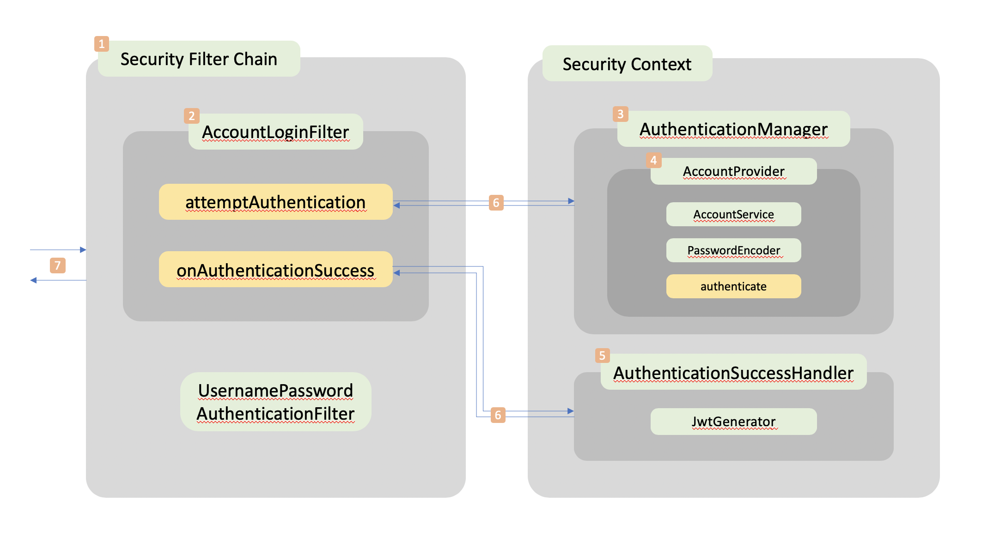
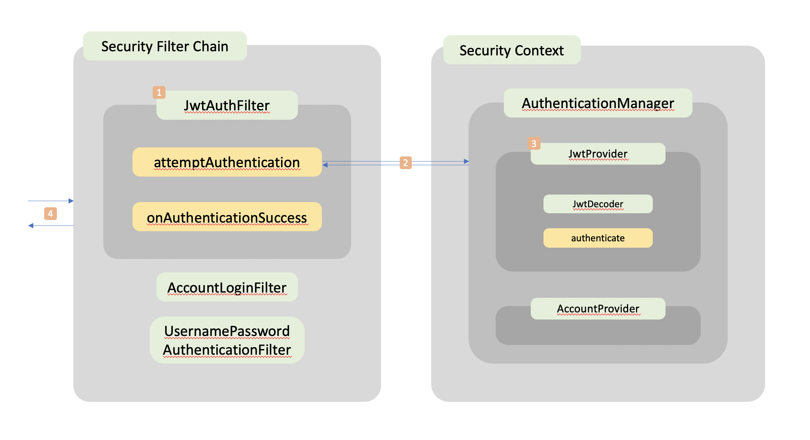

# Spring Filter
Spring Security를 활용해 Token 기반 인증/인가 시스템에 대한 이해도를 높이고       
DispatcherServlet 앞단의 Filter가 어떤 방식으로 구동되고 무엇이 필요한지 실험해보는 프로젝트이다.  


## Spring의 Authentication과 JSON Web Token

#### Spring Oauth2를 통해 시도 해봤던 Token 기반 인증과 문제점

```
1. InMemory TokenStore  
인증을 마친 클라이언트에게 발행한 토큰을 서버의 메모리에 저장하는 방식이다.
다음과 같은 문제점에 대해 생각해볼 필요가 있다.
* 서버가 다운될 시 토큰의 관리가 힘들다.
* 사용자 수가 늘어나면 메모리 효율이 떨어진다.
* 서버의 확장성에 유동적이지 못하다. 인증정보를 동기화하는 작업이 필수적이라고 볼 수 있다.

2. JDBC TokenStore
인증을 마친 클라이언트에게 발행한 토큰을 서버의 DB에 저장하는 방식이다.
다음과 같은 문제점에 대해 생각해볼 필요가 있다.
* 인증 이후의 요청에 대해 추가적으로 DB의 토큰을 조회하는 작업이 필요하기 때문에 성능면에서 좋지 못하다. 
* 서버의 확장성에 유동적이지 못하다. 인증정보를 동기화하는 작업이 필수적이라고 볼 수 있다.
```

### JSON Web Token 의 등장
Key-Value 형태의 Claim 기반 토큰이다. 포함되는 내용은 다음과 같다.
1. 서명 알고리즘과 타입을 담고 있는 Claim
2. 사용자 정보(principal)와 권한(role), 그리고 유효 기간 등의 정보를 담고 있는 Claim
3. 2번의 내용을 암호화 후 생성한 HMAC 


각각의 Claim은 개행 문자 '\n'처럼 헤더에 포함시키기 어려운 문자도 존재하기 때문에 BASE64 인코딩 방식으로 이를 하나의 문자열로 변환한다.    
토큰 검증은 토큰을 발행했던 것과 동일한 방식으로 2번에 해당하는 Claim을 암호화 한 후 3번의 HMAC과 비교해 인증이 정상적으로 이루어졌음을 검증할 수 있다.    
처음 로그인 과정을 통해 인증을 받은 클라이언트 한에서만 발급한 토큰이므로 공격자가 수정한 내용에 대해서는 충분히 대처를 할 수 있고  
공격자가 발급한 토큰을 그대로 재사용하는 경우는 토큰의 유효 기간을 짧게 잡음으로서 보완할 예정이다. (사실 이 경우는 JWT만의 문제는 아닌 것 같다)  
이로써 인증 토큰을 검증하는 과정을 필터단에서 HMAC을 검증하는 과정만으로 확인할 수 있기 때문에    
서버의 확장성이나 메모리 혹은 DB의 접근에 대한 오버헤드를 줄일 수 있음을 알 수 있다.  
> 자, 이제 JWT 기반 인증/인가를 위한 Security Filter를 어떻게 구현 하였는지 살펴볼 차례이다  


## Login Filter
Username과 Password를 활용해 인증 로직을 적용한 필터의 구동 원리를 정확히 이해한다.  
사실 그냥 Spring Security에서 제공하는 로그인 필터 그대로 사용해도 무방하다. (오히려 그게 더 쉽다)  


### Overview



### [1] SecurityFilterChain  


Spring Security가 구동되면 서블릿 앞단의 필터 체인이 생성된다.  
SecurityContextPersistenceFilter, LogoutFilter, BasicAuthenticationFilter 등등  
여러 필터가(로그를 찍어보면 10개가 나온다) 이 체인에 포함이 되고 현 프로젝트는 로그인 인증 절차를 구현하기 위해  
기존의 UsernamePasswordAuthenticationFilter를 대체, 혹은 앞단에 커스터마이징 할 필터를 둔다.  
WebSecurityConfigurerAdapter를 상속받은 클래스(SecurityConfig)에 관련 Security 설정을 진행할 것이다.  

   
### [2] AccountLoginFilter  


UsernamePasswordAuthenticationFilter를 대체할 필터이다.  
SecurityConfig의 HttpSecurity 관련 설정 부분에서 addFilterAt 메서드를 통해 기존의 필터를 대체할 수 있다.  
AccountLoginFilter는 사용자 설정 클래스 이름이고 AbstractAuthenticationProcessingFilter 라는 추상 클래스를 상속받는다.  
attemptAuthentication 메서드를 통해서 AuthenticationManager를 호출한다.  
추가로, 인증 성공 시 사용할 Handler를 생성자를 통해 주입 받는다.    


### [3] AuthenticationManager


어떻게 보면 인증 로직이 구현되는 주체라고도 볼 수 있다.  
Spring Security가 초기에 설정 해주는대로 사용을 하게 된다면 SecurityConfig 상에서  
UserDetails를 상속받는 클래스와 빈에 등록된 PasswordEncoder를 넘겨주는 것 만으로 사용자 인증 로직을 쉽게 구현할 수 있다.  
해당 프로젝트에서는 인증 로직이 구현된, 즉 authenticate 메서드를 오버라이드 할 수 있는 인터페이스인  
AuthenticationProvider를 상속받는 클래스를 AuthenticationManager에 등록하고,  
필터 체인이 필요 시 상황에 맞는 authenticate 메서드를 찾아 사용하는 방식을 구현할 것이다.  


요약 하자면,  
> 첫째, Provider를 Manager에 등록한다.  
> 둘째, Filter는 필요 시에 Manager에 등록된 Provider들을 스캔하며 필요한 authenticate 메서드를 사용한다.  

  
### [4] AccountProvider


authenticate 메서드가 오버라이드된 클래스이다.  
AuthenticationProvider를 상속받는 구조이고, 인증 절차가 진행될 메서드이므로  
빈에 등록된 AccountService와 PasswordEncoder를 주입받는다.  
존재하지 않는 Username이거나 Password가 일치하지 않는 경우 Exception을 throw 하게 된다.  

  
### [5] AuthenticationSuccessHandler


AccountFilter의 onAuthenticationSuccess가 호출이 되면 실행될 클래스이다.  
AuthenticationSuccessHandler는 인터페이스 이름이고 프로젝트의 구현체는 LoginSuccessHandler이다.  
실행 시, JWT을 생성하는 클래스인 JwtGenerator 클래스가 "com.auth0"에서 제공하는 클래스를 활용해 토큰을 생성할 것이다.  


참고로 Provider에서 authenticate 호출 시  
인증 성공의 경우 Authentication 객체가 리턴이 돼 필터의 successfulAuthentication이 실행되고,  
인증 실패의 경우 AuthenticationException 객체가 던져져 필터의 unsuccessfulAuthentication이 실행된다.  

  
### [6] UsernamePasswordAuthenticationToken


Filter와 Provider, Handler, 끼리 파라미터를 주고 받을 때,
Authentication 을 상속받은 객체를 파라미터로 넘겨야 하기 때문에  
이를 상속받은 UsernamePasswordAuthenticationToken 의 구현체가 필요하다.  
해당 프로젝트의 경우 이를 상속받는 PreAuthToken과 PostAuthToken을 활용하고 있다.  
PreAuthToken의 경우 principal은 username이고 PostAuthToken의 경우 principal은 Account 객체로 넘긴다.  

  
### [7] HttpServletRequestWrapper, DTO   


Filter Chain에 처음 Request가 들어오고 상황에 맞는 Response를 리턴하는 과정이다.  
요청을 읽는 과정에서 처음에는 ObjectMapper를 사용해 request의 reader를 호출하는 방식을 사용하려 했지만  
Tomcat 단에서 reader와 같은 inputStream을 중복해서 호출하는 것을 막는다고 한다.  
때문에 HttpServletRequestWrapper를 상속받는 클래스를 정의하여 관련 메서드를 오버라이딩 하고,  
이 클래스를 호출하여 request를 읽어들이니 해당 문제가 해결되었다.  


request를 읽어들이고 필터 내 메서드에서 참조할 수 있게끔 AccountRequestDto 클래스를 정의하였고,  
인증 후 사용자 정보와 JWT를 담아 리턴하기 위해 AccountResponseDto 클래스를 정의하였다.  


## JWT Filter
인증이 필요한 리소스에 요청을 받았을 때, 요청에 헤더에 존재하는 접근 토큰을 검증하는 역할을 담당한다.


### Overview



### [1] JwtAuthFilter  


접근 토큰을 필요로 하는 요청에 대해 토큰을 검증하는 필터이다.  
기본적인 필터의 구동 방식은 AbstractAuthenticationProcessingFilter을 상속받는 AccountLoginFilter와 동일하다.  
HttpServletRequest의 헤더 정보를 읽어들이고 헤더 이름이 "Authorization" 인 헤더를 불러들어온 후 prefix를 확인한다.  
헤더의 형식이 잘못된 경우 Exception을 발생시키고,  
정상적인 형식의 헤더인 경우 prefix 뒤의 토큰을 attemptAuthentication 내부의 authenticate메서드에 넘겨주게 된다.   

   
### [2] PreAuthLoginToken과 PreAuthJwtToken


AccountLoginFilter와 연동 하는 과정에서 꽤나 애먹었던 부분이다.  
Filter의 attemptAuthentication 부분에서 UsernamePasswordAuthenticationToken 을 상속받은 PreAuthToken을  
authenticate 메서드의 Authentication 파라미터로 넘겨 줄 때 동일한 형식의 토큰을 넘겨주는 경우  
RequestMatcher의 url 명세에 상관 없이 필터가 동작할 수도 있다는 것을 깨달았다.  
이 때문에 기존의 PreAuthToken을 필터에 따라 PreAuthLoginToken과 PreAuthJwtToken으로 분리해 사용하게 되었다.  


### [3] JwtProvider


토큰을 검증하는 authenticate 메서드가 구현된 클래스이다.  
"com.auth0"에서 제공하는 JWTVerifier를 통해 HMAC을 검증하고 기간이 만료된 토큰이 아니라면  
토큰 내의 claim들을 모두 추출한 후 SecurityContext에 저장할 클래스인 AccountContext의 형태로 리턴하게 된다.  

  
### [4] SecurityContext


JwtAuthFilter가 attemptAuthentication을 수행하고 AuthenticationException 없이 successfulAuthentication을 수행하게 된다면  
SecurityContext에 관련 Authentication을 저장한 후 doFilter를 통해 인증 완료된 요청을 처리하게 된다.  
이때 SecurityContext에 저장하게 되는 클래스인 AccountContext는 Spring Security의 User 클래스를 상속받는다.  
이 클래스에 기존의 User에서 필요로 하는 principal, credentials, authorities에 추가로 그룹 정보나 id 값을 설정한 후 SecurityContext에 저장할 수 있다.  
클라이언트의 그룹 정보나 id 값은 이후에 SecurityContext를 참조해야하는 상황에서 그룹에 따른 리소스 접근 권한이나 요청을 구분하는데 이용할 수 있다.  
토큰 검증에 실패했을 경우에는 ThreadLocal의 인증 실패한 토큰 정보를 재참조하게 되는 상황을 방지하기 위해 clearContext로 해당 내용을 지운다.  


## Reference
https://sungminhong.github.io/spring/security/  
https://sanghaklee.tistory.com/47  
https://bcho.tistory.com/999
