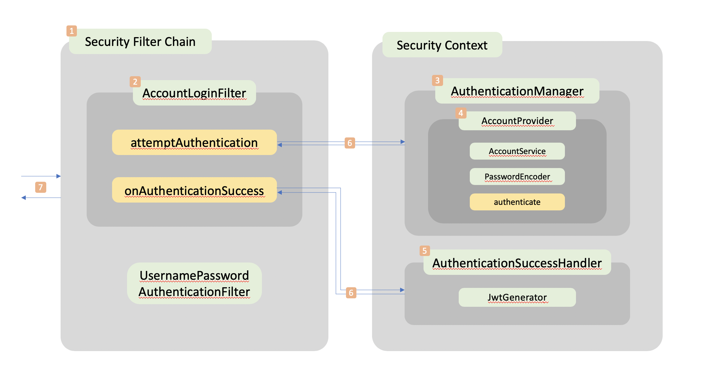

# Spring Filter
Spring Security를 활용해 Dispatcher Servlet 앞단의 Filter가 어떤 방식으로 구동이 되고 무엇이 필요한지 이해하고 실험해보는 프로젝트이다

## Login Filter
Username과 Password를 활용해 인증 로직을 적용한 필터의 구동 원리를 정확히 이해한다.  
사실 그냥 Spring Security에서 제공하는 로그인 필터 그대로 사용해도 무방하다 (오히려 그게 더 쉽다). 

### Overview

[1] SecurityFilterChain  

Spring Security가 구동되면 서블릿 앞단의 필터 체인이 생성된다.  
SecurityContextPersistenceFilter, LogoutFilter, BasicAuthenticationFilter 등등  
여러 필터가(로그를 찍어보면 10개가 나온다) 이 체인에 포함이 되고 현 프로젝트는 로그인 인증 절차를 구현하기 위해  
기존의 UsernamePasswordAuthenticationFilter를 대체, 혹은 앞단에 커스터마이징 할 필터를 둔다.  
WebSecurityConfigurerAdapter를 상속받은 클래스(SecurityConfig)에 관련 Security 설정을 진행할 것이다.  

   
[2] AccountLoginFilter  

UsernamePasswordAuthenticationFilter를 대체할 필터이다.  
SecurityConfig의 HttpSecurity 관련 설정 부분에서 addFilterAt 메서드를 통해 기존의 필터를 대체할 수 있다.  
AccountLoginFilter는 사용자 설정 클래스 이름이고 AbstractAuthenticationProcessingFilter 라는 추상 클래스를 상속받는다.  
attemptAuthentication 메서드를 통해서 AuthenticationManager를 호출한다.  
추가로, 인증 성공 시 사용할 Handler를 생성자를 통해 주입 받는다.    

[3] AuthenticationManager

어떻게 보면 인증 로직이 구현되는 주체라고도 볼 수 있다.  
Spring Security가 초기에 설정 해주는대로 사용을 하게 된다면 SecurityConfig 상에서  
UserDetails를 상속받는 클래스와 빈에 등록된 PasswordEncoder를 넘겨주는 것 만으로 사용자 인증 로직을 쉽게 구현할 수 있다.  
해당 프로젝트에서는 인증 로직이 구현된, 즉 authenticate 메서드를 오버라이드 할 수 있는 인터페이스인  
AuthenticationProvider를 상속받는 클래스를 AuthenticationManager에 등록하고,  
필터 체인이 필요 시 상황에 맞는 authenticate 메서드를 찾아 사용하는 방식을 구현할 것이다.  

요약 하자면,  
> 첫째, Provider를 Manager에 등록한다.  
> 둘째, Filter는 필요 시에 Manager에 등록된 Provider들을 스캔하며 필요한 authenticate 메서드를 사용한다.  

  
[4] AccountProvider

authenticate 메서드가 오버라이드된 클래스이다.  
AuthenticationProvider를 상속받는 구조이고, 인증 절차가 진행될 메서드이므로  
빈에 등록된 AccountService와 PasswordEncoder를 주입받는다.  
존재하지 않는 Username이거나 Password가 일치하지 않는 경우 Exception을 throw 하게 된다.  

  
[5] AuthenticationSuccessHandler

AccountFilter의 onAuthenticationSuccess가 호출이 되면 실행될 클래스이다.  
AuthenticationSuccessHandler는 인터페이스 이름이고 프로젝트의 구현체는 LoginSuccessHandler이다.  
실행 시, JWT을 생성하는 클래스인 JwtGenerator 클래스가 "com.auth0"에서 제공하는 클래스를 활용해 토큰을 생성할 것이다.  

참고로 Provider에서 authenticate 호출 시  
인증 성공의 경우 Authentication 객체가 리턴이 돼 필터의 successfulAuthentication이 실행되고,  
인증 실패의 경우 AuthenticationException 객체가 던져져 필터의 unsuccessfulAuthentication이 실행된다.  

  
[6] UsernamePasswordAuthenticationToken

Filter와 Provider, Handler, 끼리 파라미터를 주고 받을 때,
Authentication 을 상속받은 객체를 파라미터로 넘겨야 하기 때문에  
이를 상속받은 UsernamePasswordAuthenticationToken 의 구현체가 필요하다.  
해당 프로젝트의 경우 이를 상속받는 PreAuthToken과 PostAuthToken을 활용하고 있다.  
PreAuthToken의 경우 principal은 username이고 PostAuthToken의 경우 principal은 Account 객체로 넘긴다.  

  
[7] HttpServletRequestWrapper, DTO   

Filter Chain에 처음 Request가 들어오고 상황에 맞는 Response를 리턴하는 과정이다.  
요청을 읽는 과정에서 처음에는 ObjectMapper를 사용해 request의 reader를 호출하는 방식을 사용하려 했지만  
Tomcat 단에서 reader와 같은 inputStream을 중복해서 호출하는 것을 막는다고 한다.  
때문에 HttpServletRequestWrapper를 상속받는 클래스를 정의하여 관련 메서드를 오버라이딩 하고,  
이 클래스를 호출하여 request를 읽어들이니 해당 문제가 해결되었다.  

request를 읽어들이고 필터 내 메서드에서 참조할 수 있게끔 AccountRequestDto 클래스를 정의하였고,  
인증 후 사용자 정보와 JWT를 담아 리턴하기 위해 AccountResponseDto 클래스를 정의하였다.  

## To be continued..
JWT가 마이크로 서비스를 구성하는데 있어서 기존의 JDBCTokenStore나 InMemoryTokenStore에 비해 가지는 장점  
그리고 JWT를 사용할 때의 Filter, Provider, Handler 구동 원리에 대해 알아 볼 예정이다.   